<h1 align="center">
  
</h1>

  

<h2 align="center"> ⚡ Tools of The Trade ⚡</h2>

  <!-- Languages & Frontend -->
  &nbsp;&nbsp;
  &nbsp;&nbsp;
  &nbsp;&nbsp;
  &nbsp;&nbsp;
  
    
  
  <!-- Backend -->
  &nbsp;&nbsp;
  &nbsp;&nbsp;
  &nbsp;&nbsp;
  &nbsp;&nbsp;
  &nbsp;&nbsp;

    

  <!-- DevOps & Cloud -->
  &nbsp;&nbsp;
  &nbsp;&nbsp;
  &nbsp;&nbsp;
  &nbsp;&nbsp;
  &nbsp;&nbsp;
  
    

  <!-- Security & Tools -->
  &nbsp;&nbsp;
  &nbsp;&nbsp;
  &nbsp;&nbsp;
  &nbsp;&nbsp;

<h2 align="center"> 🚀 Awesome Projects 🚀 </h2>

| Project Name | Description | Link |
| :--- | :--- | :--- |
| **Play Champ** | Webapp project | [playchamp.app](https://playchamp.app) |
| **Genz Meet** | Interactive Telegram Bot & Channel | [Bot](https://t.me/genzmeet) / [Channel](https://t.me/genzmeetbotchannel) |
| **Cast Ad Bot** | Telegram Advertising Bot | [t.me/castadBot](https://t.me/castadBot) |
| **CediEarn Bot** | Telegram Earnings Bot | [t.me/CediEarnBot](https://t.me/CediEarnBot) |

<h2 align="center"> 🤝 Let's Connect 🤝 </h2>

  &nbsp;&nbsp;&nbsp;&nbsp;
  

 

  

